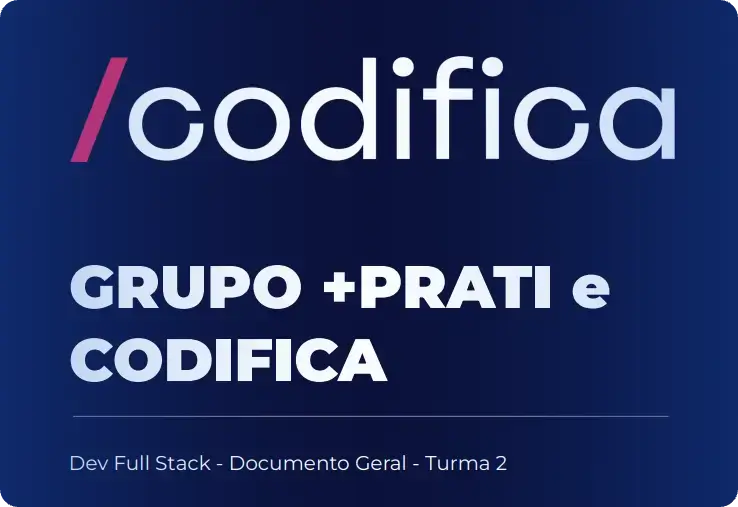

# Grupo +praTI e Codifica - Dev Full Stack Jr. - Turma 2
 
## Sobre a Codifica
Somos uma Edtech especializada no ensino de tecnologia, inovação e pensamento computacional, desde a educação básica até a educação profissional. Nosso objetivo é despertar o interesse pela tecnologia, promovendo um conhecimento democrático e de qualidade, que desenvolva habilidades essenciais para os desafios de um mundo digital.

## Sobre o +praTI
O +praTI é uma iniciativa social que surgiu em 2020, impulsionada pela falta de profissionais qualificados no setor de TI no RS. Empresários se uniram para oferecer formação gratuita para quem deseja ingressar na área de Tecnologia, seja por aptidão ou mudança de carreira, visando a construção de um futuro na TI.

## Objetivo
Proporcionar, através do conhecimento, oportunidades de emprego na área de tecnologia, causando um impacto positivo nas pessoas e empresas envolvidas no projeto.

---

## Horário das Aulas - Turma 2

### Primeiro Momento (Início: 09/07)
- **Terças-feiras**: 19h - 22h (com 20 minutos de intervalo)
  - *Exceto em dias de palestra: 20h30 - 22h30*
- **Quintas-feiras**: 19h - 22h (com 20 minutos de intervalo)
- **Sextas-feiras**: 19h - 20h30 (com 20 minutos de intervalo)

### Segundo Momento (Início: 30/10)
- **Segundas-feiras**: 19h - 22h (com 20 minutos de intervalo)
- **Quartas-feiras**: 19h - 22h (com 20 minutos de intervalo)
- **Quintas-feiras**: 19h - 22h (com 20 minutos de intervalo)
- **Sábados**: 9h - 12h (com 20 minutos de intervalo)

> **Plantão de Dúvidas**: Sempre 1 hora antes da aula, no Discord.

---

## Cronograma de Aulas

### Módulo 1 - Introdução à Lógica de Programação (7 Aulas)
[x] 1. Fundamentos da Computação I
[x] 2. Fundamentos da Computação II
[x] 3. Introdução à Lógica de Programação e JavaScript Básico
[x] 4. [Onboarding RH?], Estruturas de Controle: Repetição e Funções Básicas
[x] 5. Arrays e Funções Avançadas
[x] 6. Criação e Manipulação de Objetos em JavaScript
[x] 7. Revisão e Finalização do Módulo

### Módulo 2 - Introdução ao Controle de Versão com Git e GitHub (2 Aulas)
[x] 1. Introdução ao Git e GitHub
[x] 2. Comandos Essenciais do Git e Trabalho Colaborativo

### Módulo 3 - Fundamentos do Desenvolvimento Front-end (13 Aulas)
[x] 1. Introdução ao Desenvolvimento Front-end
[x] 2. Estruturas Essenciais do HTML
[x] 3. CSS Básico I
[x]4. CSS Básico II
[] 5. Introdução ao JavaScript e Manipulação do DOM
[] 6. Funções e Eventos do DOM
[] 7. Projeto Prático I - Construção de uma Landing Page
[] 8. Design Responsivo e Semântica Web
[] 9. Flexbox e CSS Grid
[] 10. Frameworks de CSS
[] 11. Projeto Prático II - Desenvolvimento com Frameworks
[] 12. Introdução a Testes no Front-end
[] 13. Projeto Prático III - Aplicação Front-end Completa

> **Trilha Complementar**: Design para quem não é Designer (paralelo aos módulos 3 e 4)

### Módulo 4 - Desenvolvendo Front-end com ReactJS (13 Aulas)
1. Introdução ao ReactJS e Configuração do Ambiente
2. Componentes Funcionais, Hooks e de Classe
3. Estado e Ciclo de Vida dos Componentes
4. Manipulação de Eventos e Formulários
5. Componentização Avançada
6. Roteamento com React Router
7. Gerenciamento de Estado com Context API I
8. Gerenciamento de Estado com Context API II
9. Requisições HTTP com Axios e Estilização com CSS
10. Testes Unitários com Jest e React Testing Library
11. Desenvolvimento de Aplicações CRUD com React e Redux I
12. Desenvolvimento de Aplicações CRUD com React e Redux II
13. Deploy e Otimização de Aplicações React

### Módulo 5 - Introdução à Linguagem Java (17 Aulas)
1. Introdução à Linguagem de Programação Java e Configuração do Ambiente
2. Conceitos Básicos: Variáveis e Tipos de Dados
3. Operadores e Expressões
4. Estruturas de Controle: Condicional
5. Estruturas de Controle: Repetição
6. Arrays e Coleções
7. Métodos e Funções
8. Introdução à Programação Orientada a Objetos
9. Classes, Objetos e Construtores
10. Herança e Sobrecarga
11. Polimorfismo e Interface
12. Tratamento de Exceções
13. Introdução a Estruturas de Dados: Listas e Filas
14. Estruturas de Dados: Pilhas e Mapas
15. Algoritmos - Busca e Ordenação
16. Projeto Prático I
17. Projeto Prático II

### Módulo 6 - Fundamentos de Bancos de Dados Relacionais (13 Aulas)
1. Introdução a Bancos de Dados Relacionais e Configuração do MySQL
2. Modelagem de Dados e Entidades
3. Criação e Manipulação de Tabelas
4. Consultas Simples com Select
5. Restrições de Integridade e Chaves
6. Consultas Avançadas com Select
7. Backup e Restauração de Dados
8. Segurança e Gerenciamento de Usuários
9. Introdução a Stored Procedures
10. Introdução a Triggers
11. Índices e Otimização de Consultas
12. Introdução a Views
13. Revisão e Projeto Final

### Módulo 7 - Desenvolvimento de APIs Rest com Spring Boot (13 Aulas)
1. Introdução ao Desenvolvimento Back-end
2. Conceitos Básicos de API REST e Estrutura da Internet
3. Introdução ao Spring Boot e Configuração do Ambiente
4. Manipulação de Dados com Spring Data JPA
5. Validação de Dados e Tratamento de Exceções
6. Documentação de API com Swagger
7. Autenticação e Autorização com Spring Security
8. Upload e Download de Arquivos
9. Paginação, Ordenação e Filtragem de Dados
10. Testes de Unidade e Integração com JUnit e Mockito
11. Gerenciamento de Dependências com Spring Boot Actuator
12. Integração com Banco de Dados MySQL I
13. Integração com Banco de Dados MySQL II

### Módulo 8 - Laboratório de Projeto Final (7 Aulas)
1. Introdução às Metodologias Ágeis
2. Introdução à Arquitetura de Software
3. Implementação de Testes Unitários
4. Introdução à Integração Contínua (CI)
5. Introdução à Entrega Contínua (CD)
6. Gestão de Mudanças e Versionamento de Código
7. Revisão e Entrega Final

---

## Projeto Final

### Requisitos Funcionais
- **CRUD de dados**: Criação, Visualização, Edição e Exclusão de dados;
- **Autenticação de Dados**: Implementar mecanismos seguros para a autenticação de usuários;
- **Sobre o desenvolvedor**: Página para exibição de projetos pessoais;
- **Controle de Versões**: Utilizar Git para controle de versões, hospedando o código no GitHub.

### Requisitos Técnicos ou Não-funcionais
- **Front-end**: Desenvolver utilizando ReactJS;
- **Back-end**: Utilizar o Spring Boot;
- **Banco de Dados**: Utilizar MySQL ou PostgreSQL;
- **Endpoints RESTful**: Implementar endpoints RESTful para operações CRUD;
- **Testes Unitários**: Garantir cobertura mínima de 80% nos testes;
- **CI/CD**: Implementar CI/CD para automatização e deploy contínuo;
- **Métodos Ágeis**: Utilizar metodologias ágeis para planejamento, desenvolvimento e entrega do projeto.

### Entrega do Projeto
- **Código-fonte**: Postado em um repositório público no GitHub;
- **Documentação**: Incluir instruções para execução local, descrição de arquitetura, detalhamento das funcionalidades implementadas e demais aspectos relevantes;
- **Demonstração ao vivo**: Apresentação do projeto, explicando as decisões de design, demonstrando as funcionalidades e respondendo perguntas.

---

## Avaliação
- Frequência
- Conclusão das tarefas
- Percepção do professor
- Conclusão e qualidade do projeto final

---

## FAQ

- **O curso é gratuito?**
  - Sim, é uma bolsa de estudos gratuita. Os alunos que se destacarem serão encaminhados para entrevistas de emprego ou estágio.

- **São necessários conhecimentos prévios de programação?**
  - Não, o curso parte do nível introdutório.

- **Não consigo assistir às aulas à noite, e agora?**
  - Todas as aulas ficarão gravadas e poderão ser acessadas posteriormente.

- **O curso emite certificado?**
  - Sim, ao final do curso, sendo aprovado nas atividades, será gerado um certificado.
